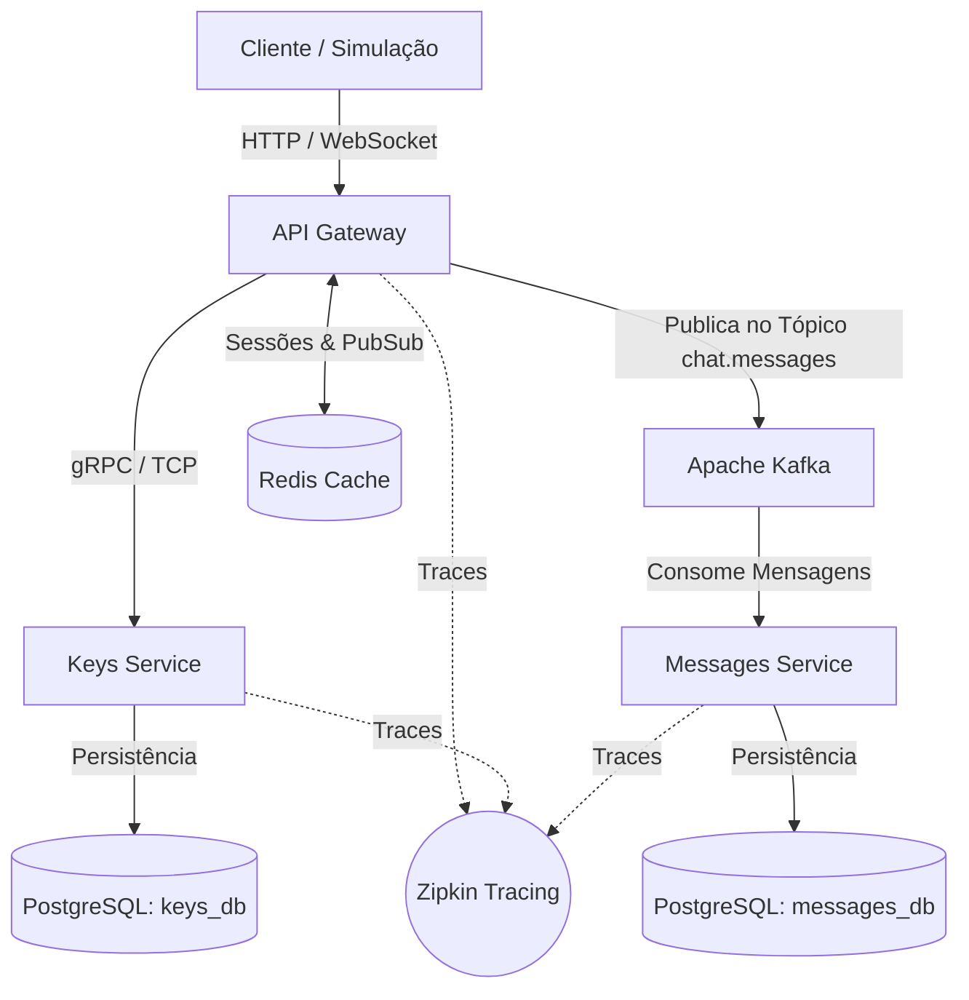

# POC E2EE em Go

Esta POC é uma demonstração avançada de **Criptografia Ponta a Ponta (E2EE)** com foco em segurança de ponta, alta escalabilidade e resiliência com uma **arquitetura distribuída de microserviços orientada a eventos** e instrumentada com **rastreamento distribuído**.

A aplicação garante que os servidores armazenem e roteiem mensagens sem jamais possuírem a capacidade de ler o seu conteúdo. Além da confidencialidade, esta evolução arquitetural traz capacidades de processamento em larga escala através de mensageria assíncrona com Apache Kafka e comunicação bidirecional de baixíssima latência.

---

## Arquitetura do Sistema

O sistema foi decomposto em domínios independentes e especializados, integrados por mensageria e chamadas gRPC:



1. **API Gateway ([api-gateway](file:///home/israel.costa/Projetos/Pessoal/POC-E2EE/api-gateway))**
   - Porta de entrada pública para clientes HTTP e WebSockets.
   - Autentica os clientes utilizando **JWT (JSON Web Tokens)**.
   - Encaminha comandos de registro e consulta de chaves via **gRPC** para o `keys-service`.
   - Gerencia sessões ativas e faz a ponte Pub/Sub com o Redis para entrega em tempo real.
   - Publica as mensagens recebidas de forma assíncrona no **Apache Kafka** (`chat.messages`), desacoplando o fluxo de escrita rápida.

2. **Keys Service ([keys-service](file:///home/israel.costa/Projetos/Pessoal/POC-E2EE/keys-service))**
   - Microserviço interno puramente **gRPC**.
   - Gerencia o registro de identidades (Ed25519) e o provisionamento de chaves públicas Diffie-Hellman (X25519).
   - Emite os tokens de acesso (JWT).
   - Possui seu próprio banco de dados relacional isolado (`keys_db`).

3. **Messages Service ([messages-service](file:///home/israel.costa/Projetos/Pessoal/POC-E2EE/messages-service))**
   - Consumidor assíncrono (Worker) que lê mensagens do tópico `chat.messages` do **Apache Kafka**.
   - Persiste as mensagens criptografadas no banco de dados para entrega offline caso o destinatário não esteja conectado.
   - Disponibiliza uma interface gRPC para recuperação de histórico.
   - Possui seu próprio banco de dados relacional isolado (`messages_db`).

4. **Apache Kafka (Event Broker)**
   - Garante resiliência e processamento sob demanda de grandes volumes de mensagens.
   - Desacopla o gateway do banco de dados, protegendo o sistema contra picos de carga.

5. **Redis (Event Broker & Session Cache)**
   - Controla o estado de "Online/Offline" de cada usuário.
   - Roteia mensagens em tempo real via canais **Pub/Sub** direto para as conexões WebSocket ativas do Gateway.

6. **PostgreSQL**
   - Bancos de dados independentes versionados por `golang-migrate` (`keys_db` na porta `5435` e `messages_db` na porta `5433`).

---

## Segurança Criptográfica

A arquitetura criptográfica foi construída utilizando **Criptografia de Curva Elíptica (ECC)**, garantindo maior segurança com chaves menores e computações significativamente mais eficientes.

Todo o processamento criptográfico ocorre estritamente nos dispositivos clientes (ou na camada simulada `pkg/clientcrypto`). O fluxo utiliza **ECDHE (Elliptic Curve Diffie-Hellman Ephemeral)**:

### Diagrama de Fluxo E2EE

Abaixo está o diagrama do processo de comunicação segura entre Alice e Bob (que pode ser simulado. Mais abaixo eu explico como), cobrindo o envio da mensagem original e a posterior resposta de Bob:

```mermaid
sequenceDiagram
    participant Alice
    participant API Gateway
    participant DB Keys
    participant Kafka/Redis
    participant Bob

    %% 1. Geração de Chaves e Registro
    rect rgb(20, 20, 20)
    Note over Alice,Bob: 1. Registro e Geração de Chaves
    Alice->>Alice: Gera Identity (Ed25519) e DH (X25519)
    Bob->>Bob: Gera Identity (Ed25519) e DH (X25519)
    
    Alice->>API Gateway: POST /keys (IdentityPubKey, DhPubKey)
    API Gateway->>DB Keys: Salva Chaves Públicas de Alice
    API Gateway-->>Alice: JWT Token
    
    Bob->>API Gateway: POST /keys (IdentityPubKey, DhPubKey)
    API Gateway->>DB Keys: Salva Chaves Públicas de Bob
    API Gateway-->>Bob: JWT Token
    end

    %% 2. Conexão WebSocket
    rect rgb(30, 20, 30)
    Note over Alice,Bob: 2. Conexão WebSocket
    Alice->>API Gateway: WS /ws (Autentica com Token)
    Bob->>API Gateway: WS /ws (Autentica com Token)
    end

    %% 3. Mensagem 1: Alice -> Bob
    rect rgb(20, 30, 20)
    Note over Alice,Bob: 3. Mensagem 1: Alice enviando para Bob
    Alice->>API Gateway: GET /keys/Bob
    API Gateway-->>Alice: Retorna DhPubKey e IdentityPubKey do Bob
    
    Alice->>Alice: [ECDHE] Deriva AES Key (usando Bob DhPubKey)<br/>Gera EphemeralPubKey Alice
    Alice->>Alice: [AES-GCM] Criptografa a Mensagem 1
    Alice->>Alice: [Ed25519] Assina o Payload<br/>(usando Alice IdentityPrivKey)
    
    Alice->>API Gateway: Envia Mensagem WS 1<br/>(to: Bob, EphemeralPubKey Alice, EncryptedPayload, Signature)
    API Gateway->>Kafka/Redis: Persiste no Kafka e Publica no Redis (pub/sub)
    Kafka/Redis-->>API Gateway: Entrega no Canal WS do Bob
    API Gateway-->>Bob: Recebe Mensagem WS 1
    
    Bob->>API Gateway: GET /keys/Alice
    API Gateway-->>Bob: Retorna IdentityPubKey e DhPubKey da Alice
    
    Bob->>Bob: [Ed25519] Verifica a Assinatura (usando Alice IdentityPubKey)
    Bob->>Bob: [ECDHE] Deriva AES Key (usando Bob DhPrivKey e EphemeralPubKey Alice)
    Bob->>Bob: [AES-GCM] Descriptografa e lê a Mensagem 1!
    end

    %% 4. Mensagem 2: Bob -> Alice (Resposta)
    rect rgb(30, 30, 20)
    Note over Alice,Bob: 4. Mensagem 2: Resposta de Bob para Alice
    Bob->>Bob: [ECDHE] Deriva AES Key (usando Alice DhPubKey)<br/>Gera EphemeralPubKey Bob
    Bob->>Bob: [AES-GCM] Criptografa a Mensagem 2 (Resposta)
    Bob->>Bob: [Ed25519] Assina o Payload de Resposta<br/>(usando Bob IdentityPrivKey)
    
    Bob->>API Gateway: Envia Mensagem WS 2<br/>(to: Alice, EphemeralPubKey Bob, EncryptedPayload, Signature)
    API Gateway->>Kafka/Redis: Persiste no Kafka e Publica no Redis (pub/sub)
    Kafka/Redis-->>API Gateway: Entrega no Canal WS da Alice
    API Gateway-->>Alice: Recebe Mensagem WS 2
    
    Alice->>Alice: [Ed25519] Verifica a Assinatura (usando Bob IdentityPubKey)
    Alice->>Alice: [ECDHE] Deriva AES Key (usando Alice DhPrivKey e EphemeralPubKey Bob)
    Alice->>Alice: [AES-GCM] Descriptografa e lê a Mensagem 2!
    end
```



---

## Observabilidade e Tracing Distribuído

A aplicação utiliza **OpenTelemetry** para instrumentar a jornada das mensagens de ponta a ponta, permitindo visibilidade total do fluxo distribuído. O backend de armazenamento e visualização padrão é o **Zipkin**.

- **gRPC Auto-instrumentação**: Utiliza `otelgrpc` para propagar contextos de rastreamento através das chamadas de rede internas.
- **Rastreamento de Mensageria**: Permite identificar latência, gargalos e falhas desde o clique de envio do cliente, passando pelo Gateway, publicação no Kafka, consumo no worker e persistência no banco de dados.

---

## Como Executar

### Pré-requisitos
- Docker e Docker Compose
- Go 1.25+ (opcional, apenas para rodar a simulação fora do container)

### 1. Subindo a Infraestrutura e Serviços
Toda a arquitetura está orquestrada via [docker-compose.yml](file:///home/israel.costa/Projetos/Pessoal/POC-E2EE/docker-compose.yml). Os microserviços utilizam *Multi-Stage builds* com targets de desenvolvimento (`dev`) que montam o código atual em tempo de execução.

Para iniciar tudo (bancos de dados, Redis, Kafka, Zipkin, rodar migrações e subir os microserviços):

```bash
docker compose up --build
```

### 2. Rodando a Simulação E2EE Real-Time
Com a infraestrutura ativa, execute o script da simulação no terminal. O script cria dinamicamente Alice e Bob, efetua autenticação com geração de tokens JWT, inicia canais WebSocket concorrentes, realiza o acordo de chaves efêmeras (ECDHE) e transmite uma mensagem ponta a ponta.

```bash
go run ./cmd/simulation/main.go
```

Você verá a saída no terminal demonstrando a autenticidade e decriptação com sucesso:

```text
🚀 Iniciando simulação E2EE em tempo real...
✔ Assinatura digital (Ed25519) da Alice verificada com sucesso!
✔ Bob leu a mensagem: Olá, Bob, este é um segredo E2EE em TEMPO REAL (PFS via ECDHE)!
🎉 Simulação concluída com sucesso!
```

### 3. Acessando o Rastreamento (Zipkin)
Abra seu navegador no endereço:
 **[http://localhost:9411](http://localhost:9411)**

No painel do Zipkin, você pode buscar por traces gerados na aplicação e ver a linha do tempo completa da propagação de cada requisição.

---

## Estrutura do Projeto

```text
api-gateway/        API HTTP, Handlers WebSocket, Produtor Kafka e Roteador Redis/gRPC
cmd/simulation/     Script do "Cliente" que executa todo o fluxo de criptografia, assinatura e websocket
db/migrations/      Scripts de migração SQL (Up/Down) versionados para PostgreSQL
deploy/docker/      Dockerfiles para os serviços
keys-service/       Microserviço gRPC de chaves (Ed25519 e X25519), registro e JWT
messages-service/   Microserviço gRPC de histórico e Consumidor Kafka (Worker de persistência)
pkg/
  ├── clientcrypto/ Biblioteca Criptográfica do Cliente (ECDHE-X25519, Ed25519, AES-GCM, HKDF)
  ├── jwtutils/     Utilitários de validação e parser de tokens JWT 
  ├── pb/           Código gerado automaticamente a partir de contratos Protobuf (.proto)
  └── tracing/      Inicialização e configuração do OpenTelemetry com Exportador Zipkin
proto/              Contratos gRPC e definições do protocolo em Protobuf (.proto)
```

---

## Decisões de Arquitetura & Trade-Offs

- **Kafka vs. gRPC síncrono para gravação**: A minha primeira ideia com o fluxo exigia que o Gateway esperasse a resposta do banco de dados do `messages-service` antes de responder ao cliente WebSocket. Ao introduzir o Kafka, as mensagens são despachadas na fila instantaneamente e salvas em segundo plano. Isso aumenta drasticamente o throughput e garante que instabilidades temporárias no banco de dados não derrubem a entrega de mensagens em tempo real.
- **ECDHE Curve25519 vs. Signal Protocol Completo**: O Signal Protocol é o estado da arte para chats, porém requer a implementação da máquina de estados do *Double Ratchet* com rotação constante de chaves a cada resposta. Para esta POC, o **ECDHE (com chaves efêmeras geradas pelo remetente)** foi selecionado por implementar perfeitamente a propriedade de *Perfect Forward Secrecy* sem trazer o excesso de complexidade e dependências externas que poderiam obscurecer o propósito demonstrativo do código.
- **Curvas Ed25519 + X25519 vs. RSA**: Chaves RSA 3072-bit possuem custo computacional alto e payloads grandes. O uso de chaves ECC de 256 bits reduz o consumo de banda de rede ao transacionar chaves públicas e assinaturas digitais, além de executar operações matemáticas muito mais rápidas no cliente.
- **Rastreamento Distribuído**: Em sistemas de mensageria assíncrona, debugar onde um pacote se perdeu (se no gateway, no broker ou no worker) é extremamente complexo. A instrumentação OpenTelemetry resolve isso correlacionando todas as etapas sob o mesmo ID de rastreamento.
